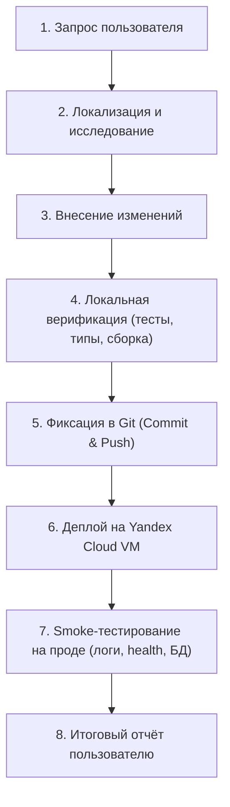

# Пайплайн работы агента над проектом QuietChat (MAX Messenger Bot & Mini App)

Настоящий документ регламентирует стандартный пошаговый процесс (инженерный регламент), которому должен следовать AI-агент при получении любой задачи по доработке, исправлению багов или развёртыванию в данном проекте.

---

## Общая схема пайплайна



---

## 1. Приём и анализ задачи (Triage & Localization)

1. **Понять суть проблемы**:
   - Что именно сломалось или какую функциональность нужно добавить?
   - В каком слое системы возникает ошибка:
     - `apps/web`: фронтенд Mini App (React, Vite, `@maxhub/max-ui`, MAX WebApp SDK).
     - `apps/api`: REST API (Fastify, маршруты `/api/auth/max`, `/api/auth/token`, `/api/profile`, `/webhooks/max`).
     - `apps/worker`: фоновый воркер (обработка вебхуков MAX Bot API, рассылка алертов жильцам, генерация YandexGPT-сводок).
     - `packages/shared`: схемы Zod, контракты DTO, типы пользователей и обновлений.
     - `packages/database`: схемы Drizzle ORM, миграции PostgreSQL.
     - `packages/config`: валидация переменных окружения.
     - `deploy/`: скрипты материализации Lockbox, Caddyfile, systemd-сервисы, Docker compose.

2. **Найти точные файлы и строки**:
   - Использовать `grep_search` для поиска ключевых слов, названий маршрутов, таблиц или текстов ошибок.
   - Использовать `view_file` для чтения исходного кода и понимания контекста.
   - **Не делать предположений**: проверять реальные структуры данных и документацию (например, спецификацию MAX на `https://dev.max.ru/docs`).

---

## 2. Внесение изменений (Implementation)

1. **Соблюдать правила изоляции пакетов**:
   - Общие структуры данных и валидаторы объявлять в `packages/shared`.
   - Модели данных БД изменять через `packages/database/src/schema.ts` с генерацией миграций (`pnpm db:generate`).
   - Если API стороннего сервиса (MAX Messenger) может присылать нестандартные или расширенные поля — всегда добавлять защитные механизмы:
     - Поддержка альтернативных ключей (`user_id` и `id`).
     - Числа и строки (`z.union([z.number(), z.string().transform(Number)])`).
     - Обработка `null` и `undefined` (`.nullable().optional()`).
     - Использование `.passthrough()`, чтобы Zod не отклонял полезные метаданные.
2. **Точечные правки**:
   - Использовать `replace_file_content` для внесения изменений.
   - Сохранять существующие комментарии, стилистику и сигнатуры функций.

---

## 3. Локальная проверка и тестирование (Local Verification)

Перед отправкой изменений в Git обязательно выполнить локальную проверку:

1. **Запуск тестов**:
   ```cmd
   cmd /c pnpm test
   ```
   *Примечание:* В Windows PowerShell вызывать через `cmd /c`, чтобы обойти системные политики блокировки `.ps1`-скриптов. Все тесты во всех воркспейсах должны возвращать `code 0`.

2. **Проверка типов TypeScript**:
   ```cmd
   cmd /c pnpm typecheck
   ```

3. **Проверка сборки веб-клиента**:
   ```cmd
   cmd /c pnpm --filter @quiet-chat/web build
   ```

---

## 4. Фиксация изменений в Git (Commit & Push)

1. **Проверить текущую ветку**:
   ```bash
   git status
   git branch
   ```
   *Важно:* Основная актуальная ветка для разработки и деплоя — **`dev-chat-max`**. Не коммитить напрямую в устаревшие ветки без указания пользователя.

2. **Учесть настройки сетевого прокси в Windows**:
   - Если `git push` или `git pull` завершается с ошибкой `CONNECT tunnel failed, response 407`, убедиться, что локальный прокси отключен:
     ```cmd
     cmd /c "git config --global http.proxy \"\""
     ```

3. **Сделать коммит и запушить**:
   ```bash
   git add <измененные файлы>
   git commit -m "Понятное описание сути изменений"
   git push origin dev-chat-max
   ```

---

## 5. Развёртывание на Yandex Cloud (YC Deployment)

Инфраструктура проекта развернута на виртуальной машине Yandex Cloud:
- **IP хоста**: `158.160.226.198` (домен `https://158-160-226-198.sslip.io`)
- **Пользователь**: `yc-user`
- **SSH-ключ**: `C:\Users\Rostyan\.ssh\id_ed25519`
- **Рабочий каталог**: `/opt/quiet-chat`
- **Активный Lockbox Secret ID**: `e6qg6df242g18nd4e5mv`

### Шаги деплоя:

1. **Подключиться и обновить код на сервере**:
   ```bash
   ssh -i C:\Users\Rostyan\.ssh\id_ed25519 -o StrictHostKeyChecking=no yc-user@158.160.226.198 "cd /opt/quiet-chat && sudo git pull origin dev-chat-max"
   ```
   *(Если каталог не является git-репозиторием, выполнить синхронизацию измененных файлов через SCP/tar).*

2. **Актуализировать переменные окружения из Yandex Lockbox**:
   ```bash
   ssh -i C:\Users\Rostyan\.ssh\id_ed25519 -o StrictHostKeyChecking=no yc-user@158.160.226.198 "sudo /bin/sh /opt/quiet-chat/deploy/scripts/materialize-lockbox-env.sh e6qg6df242g18nd4e5mv /opt/quiet-chat/.env.production"
   ```
   *Проверить токен:* Хвост `MAX_BOT_TOKEN` в файле должен быть `MXfxSM`.

3. **Пересобрать и перезапустить контейнеры с обязательным пересозданием**:
   ```bash
   ssh -i C:\Users\Rostyan\.ssh\id_ed25519 -o StrictHostKeyChecking=no yc-user@158.160.226.198 "cd /opt/quiet-chat && sudo docker compose --env-file .env.production -f compose.production.yaml up -d --build --force-recreate"
   ```
   *Важно:* Флаг `--force-recreate` обязателен! Без него Docker не обновляет переменные окружения запущенного контейнера.

---

## 6. Проверка работоспособности на проде (Production Health & Smoke Testing)

1. **Проверка эндпоинта готовности (Readiness Check)**:
   ```bash
   curl -sS -i https://158-160-226-198.sslip.io/health/ready
   ```
   Ожидаемый ответ: `HTTP/2 200 OK`, JSON с состоянием БД и сервисов.

2. **Проверка статуса контейнеров**:
   ```bash
   ssh -i C:\Users\Rostyan\.ssh\id_ed25519 -o StrictHostKeyChecking=no yc-user@158.160.226.198 "sudo docker ps"
   ```
   Все 6 контейнеров (`gateway`, `api`, `worker`, `postgres`, `cleanup`, `backup`) должны иметь статус `Up`.

3. **Проверка логов на наличие ошибок**:
   ```bash
   ssh -i C:\Users\Rostyan\.ssh\id_ed25519 -o StrictHostKeyChecking=no yc-user@158.160.226.198 "sudo docker logs --tail 30 quiet-chat-api-1 && sudo docker logs --tail 30 quiet-chat-worker-1"
   ```

4. **Проверка данных в PostgreSQL (при изменении данных/схемы)**:
   ```bash
   ssh -i C:\Users\Rostyan\.ssh\id_ed25519 -o StrictHostKeyChecking=no yc-user@158.160.226.198 "sudo docker exec quiet-chat-postgres-1 psql -U quietchat -d quietchat -c 'SELECT count(*) FROM resident_profiles;'"
   ```
   *Замечание:* Имя базы и пользователя — `quietchat` (слитно).

5. **Тестирование Mini App в браузере**:
   - Чат с ботом: `https://web.max.ru/355531174` (бот `@se14396800_bot`).
   - Нажать кнопку в диалоге и убедиться в отсутствии ошибок авторизации.

---

## 7. Формирование отчёта пользователю (Reporting)

По окончании работы агент обязан предоставить краткий и структурированный отчёт:
1. **Что было причиной проблемы** (кратко, 1–2 предложения).
2. **Какие файлы были изменены** (с ссылками на файлы).
3. **Результаты локальных тестов** (пройдены ли юнит-тесты и сборка).
4. **Хеш коммита и ветка** (например, `cba7159` в `dev-chat-max`).
5. **Результаты проверки на проде** (статус HTTP, логи, записи в базе данных).
6. **Инструкция для пользователя** (что открыть, куда нажать для финальной проверки).
